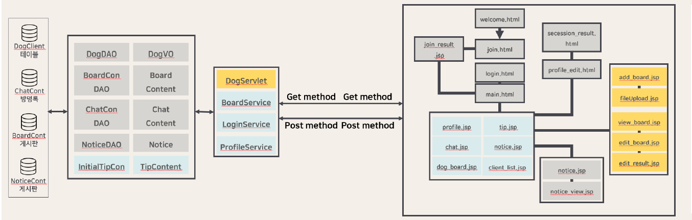
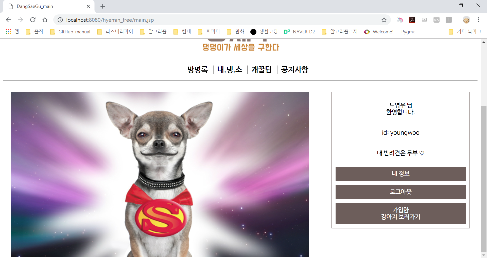
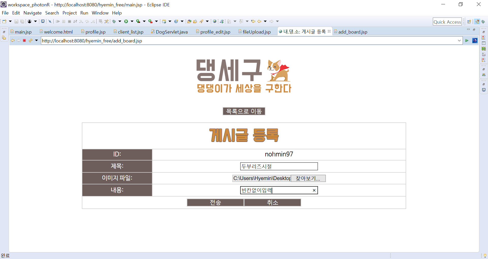

# 2018 웹 프로그래밍 과제  

##### MVC패턴을 활용한 반려동물 커뮤니티 사이트 제작
##### 구현 기간: 2018.11.14 ~ 2018.11.28
-------------
## 1. 개발 개요

MVC패턴을 활용한 게시판 기능을 제공하는 커뮤니티 사이트 제작  

### 주요 기능

* 반려견 상식 페이지 링크  
* 게시판 기능 구현 ( 게시물 등록, 수정, 삭제)  
* 방명록 기능 구현  
* 로그인, 로그아웃, 회원가입 기능  

## 2. 컴포넌트 구성

## 3. 기술 스택

* Java  
* JSP  
* MySQL  

## 4. 실행 화면

